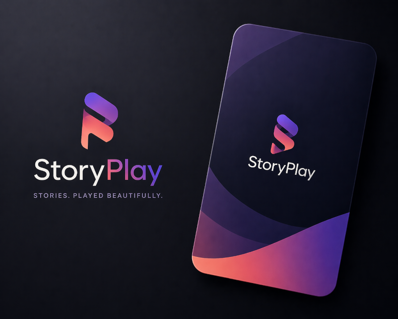

# StoryPlay

| Logo | Description |
|---|---|
|  | StoryPlay is a **Twine-inspired visual story builder** for branching interactive fiction: a **node graph** editor (**React Flow**), **global variables**, **conditional choices** with effects, a **Play Preview**, three **mini-game** block types with a dedicated editor, and **JSON export** (v1) of the current story. |

[](#)

## Story blocks

[](#block-types) [](#block-types) [](#block-types) [](#block-types)

## Screenshot


## Mini-game blocks

[](#block-types) [](#block-types) [](#block-types)

## Planned mini-games

[](#) [](#) [](#) [](#) [](#)

## Contents

- [StoryPlay](#storyplay)
  - [Block types](#block-types)
  - [Features](#features)
  - [Export](#export)
  - [Tech stack](#tech-stack)
  - [Running locally](#running-locally)
  - [Changelog](#changelog)
  - [Planned features](#planned-features)

## Block types

### Story blocks

- **Narrative** — Body text plus branching **choices** (label, target node, optional **conditions** and **effects** on variables).
- **Chat** — Line-based script rendered as bubbles; lines starting with `You:` are outgoing. After the scripted sequence, the player picks from the block’s **choices** as replies.
- **Timed** — **Countdown**; at zero the preview can jump to a **timeout target** node and apply **timeout effects** (same effect model as choices).
- **Ending** — Typically has no choices; used as a terminal beat.

### Mini-game blocks

Edited in the sidebar summary plus a **full-screen mini-game editor** (header: **Open Mini-Game Editor** when a mini-game node is selected):

- **Trait picker** — Pick traits within min/max counts; optional **trait list variable** and per-trait variable patches.
- **Persuasion** — Score, threshold, turns, dialogue lines with deltas; **success** / **failure** branch node ids and optional score/success variables.
- **Choice weighting** — Distribute a fixed **point budget** across options; optional **result variable**, **variable prefix**, and exact-total lock.

## Features

- **Graph canvas** (React Flow): add nodes, drag positions, draw connections from handles to create choices, **search**, **minimap**, **controls**, background grid.
- **Block inspector**: title, `blockType`, content (narrative / chat / ending / mini-game prompt), timed timer + timeout wiring.
- **Choice editor**: targets, conditions (`equals`, `notEquals`, numeric compares, …), effects (`set`, `add`, `subtract`, `toggle`).
- **Variables** panel (global defaults) and **story diagnostics** (graph health: missing targets, undefined variables in conditions/effects, etc.).
- **Play Preview**: start from selected node, follow allowed choices, **Back** (history), **Reset**; supports narrative, chat (staggered reveal), timed auto-advance, and the three mini-game UIs.
- **Export Game** (header): downloads **StoryPlay export v1** JSON (`schemas/storyplay-export.v1.schema.json`). In **dev** only: `window.__storyplayLogExport()` and `window.__storyplayDownloadExport()` in the console.

## Export

The file includes `formatVersion`, optional `exportedAt`, and `story: { variables, nodes }` (same shape as editor state). **Edges** are not stored; they are implied by each node’s `choices[].targetNodeId`. **Import**, bundled **assets**, and a standalone **player** package are not implemented yet; see [CHANGELOG.md](CHANGELOG.md) for limitations and next steps.

## Tech stack

React · Vite · React Flow · JavaScript · TypeScript (mini-game block views and `src/types`)

## Running locally

```bash
npm install
npm run dev
```

Then open [http://localhost:5173](http://localhost:5173).

## Changelog

See [CHANGELOG.md](CHANGELOG.md) for release notes and notable changes.

## Planned features

- **Import** v1 JSON into the editor (with validation and clear errors).
- **Runtime** application of **enter effects** on node entry (data exists today; Play Preview does not run them).
- **Richer distribution**: asset bundling, optional runtime-only export, ZIP or single-file player.
- **Additional mini-games** (see “Planned mini-games” badges above).
- **Puzzle widgets** and deeper **inventory** flows.
